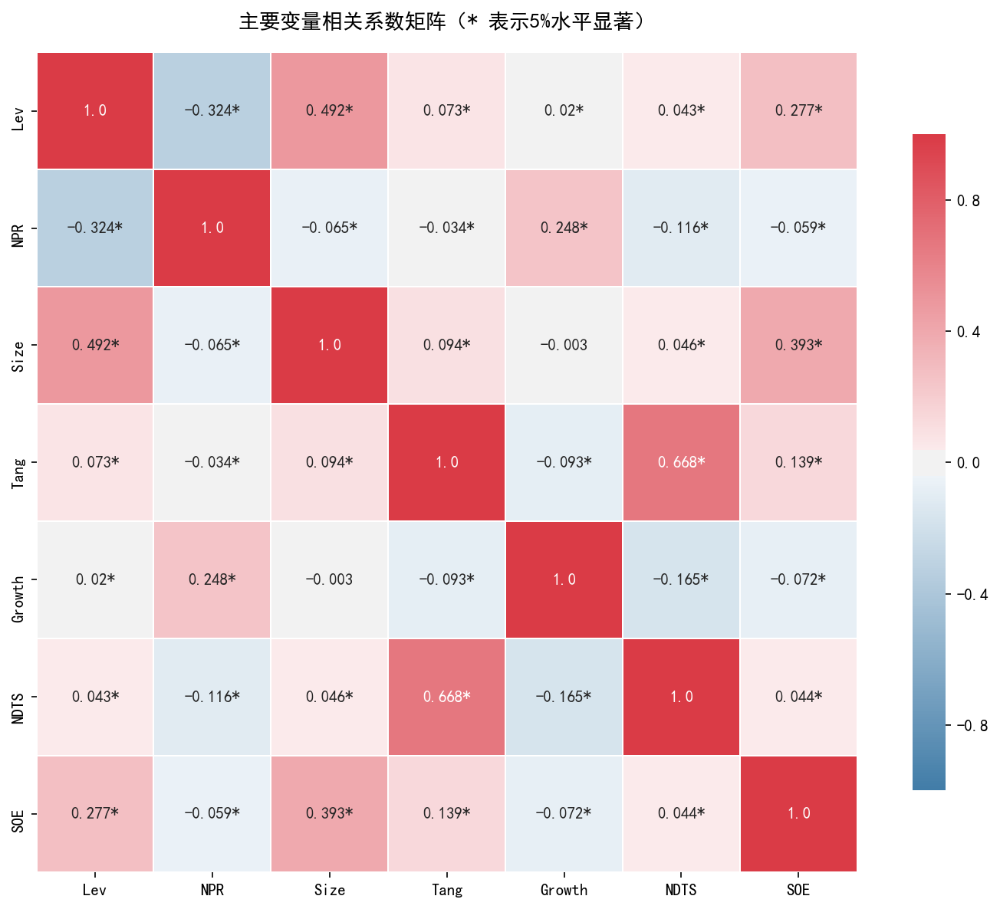
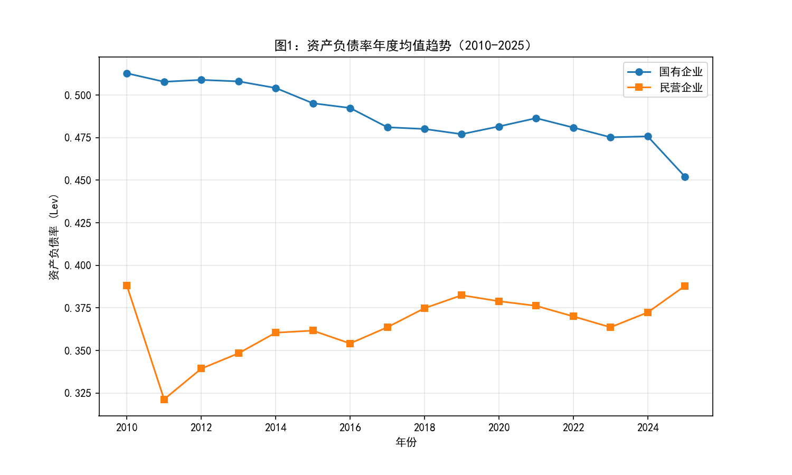
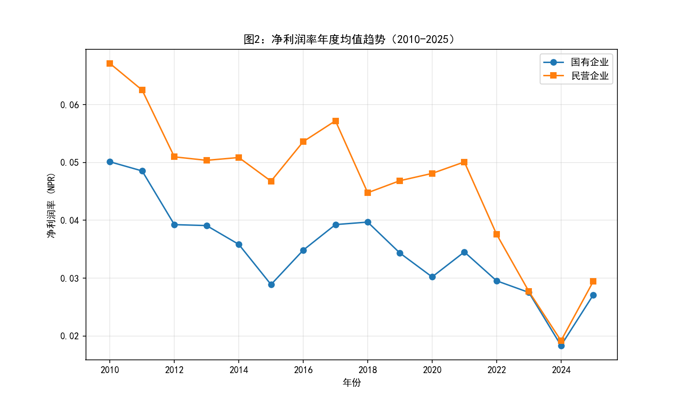
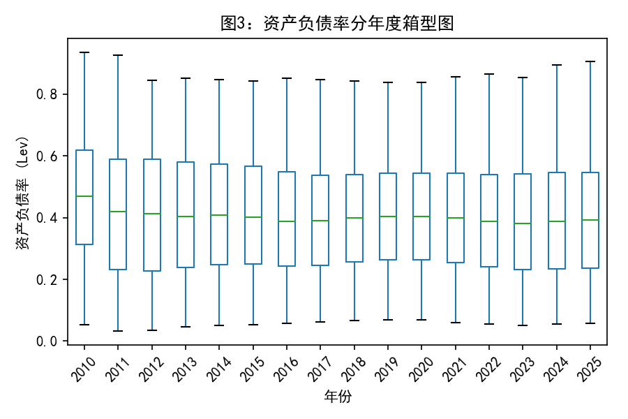
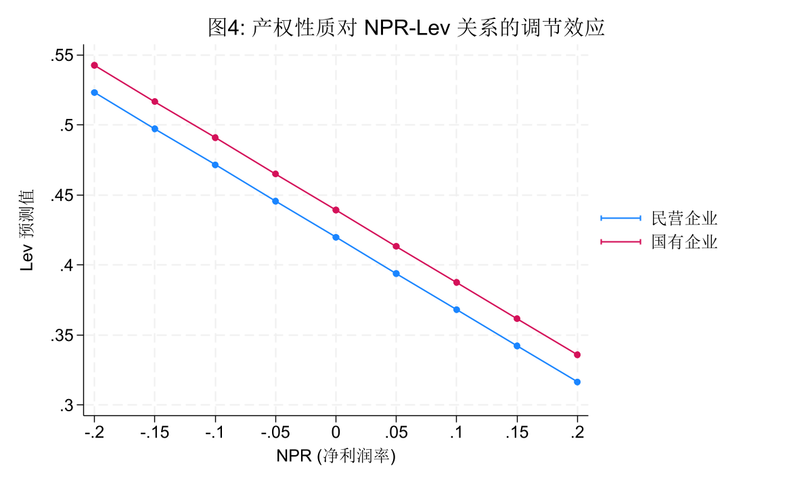
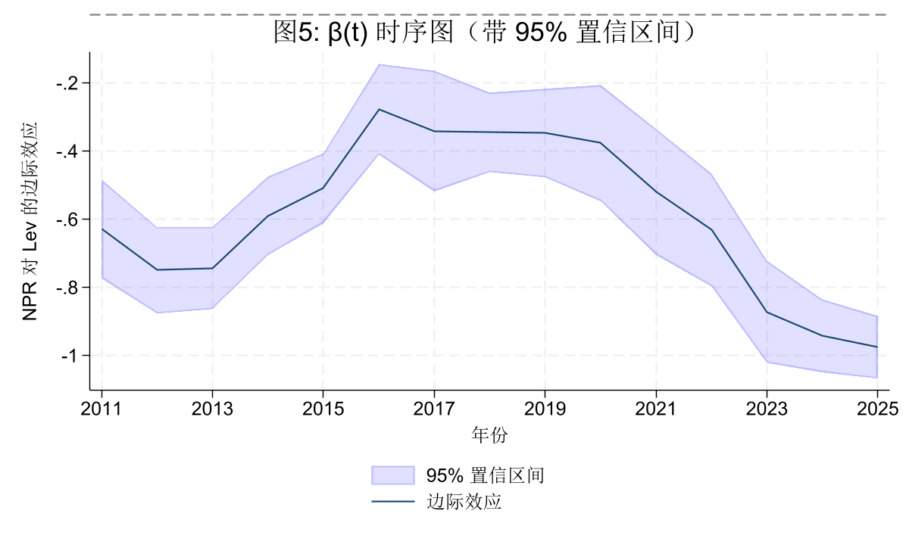
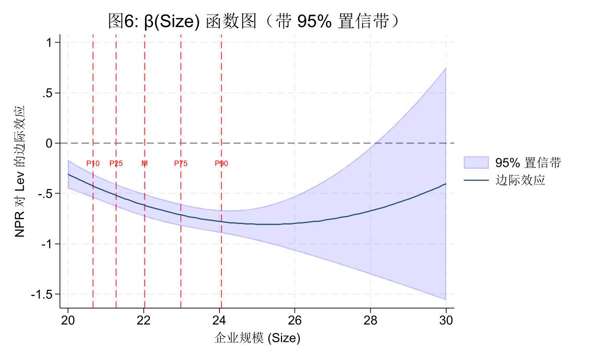
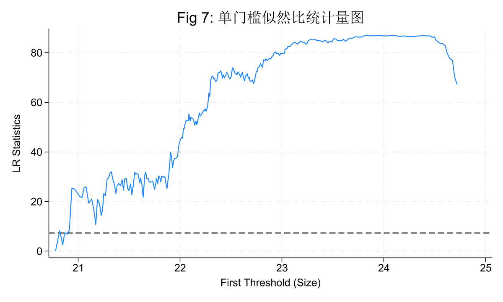

##  1. 研究背景与问题

### 研究背景
资本结构是公司财务领域的核心议题。两大主流理论对同一现象给出了截然相反的预测：

- **权衡理论（Trade-off Theory）**：企业在债务税盾收益和财务困境成本之间寻求平衡。盈利能力越强，税盾价值越大、偿债能力越强，故预测 $NPR$ 与 $Lev$ **正相关**。
- **优序融资理论（Pecking Order Theory）**：企业按照内源融资 → 债务融资 → 股权融资的顺序选择资金来源。盈利能力越强，内源资金越充裕，对外部债务的需求越低，故预测 $NPR$ 与 $Lev$ **负相关**。

### 研究假设
本作业以 A 股上市公司为样本，通过多种面板数据模型系统检验两个理论的预测，并进一步分析产权性质（SOE）对这一关系的调节作用，以及 NPR-Lev 关系随时间和企业规模的异质性。核心研究问题包括：
1. A 股上市公司资本结构更符合哪种理论？
2. 产权性质如何调节这一关系？
3. NPR-Lev 关系是否随时间发生结构性变化？
4. 企业规模如何非线性地影响这一关系？

---

## 2. 数据来源和变量定义

### 数据来源
- 数据库：CSMAR（中国股票市场与会计研究数据库）
- 样本区间：2010-2025 年（年度数据）
- 数据表：资产负债表、利润表、现金流量表、股权性质、行业分类、交易状态、M2 货币供应量

### 样本筛选

| 筛选步骤 | 剔除观测数 | 剩余观测数 | 剩余公司数 |
|----------|-----------|-----------|-----------|
| 初始样本 | — | 58,811 | 5,703 |
| 剔除金融保险 | 1,479 | 57,332 | 5,659 |
| 剔除 ST/PT | 10,334 | 46,998 | 4,931 |
| 剔除 Lev > 1 | 28 | 46,970 | 4,931 |
| 剔除缺失值 | 3,259 | 43,711 | 4,820 |
| **最终样本** | | **43,711** | **4,820** |

> *注：上述数据为包含 2010 年后重新生成的结果，实际运行中的回归模型可能因 singleton 剔除等因素导致有效观测数略有不同。*

### 变量定义

| 变量 | 定义 | 说明 |
|------|------|------|
| Lev | 总负债 / 总资产 | 因变量 |
| NPR | 净利润 / 总资产 | 核心解释变量 |
| Size | ln(总资产) | 控制变量 |
| Tang | 固定资产净值 / 总资产 | 控制变量 |
| Growth | (总资产_t - 总资产_{t-1}) / 总资产_{t-1} | 控制变量 |
| NDTS | 折旧与摊销 / 总资产 | 控制变量 |
| SOE | 国有企业=1，民营企业=0 | 调节变量 |
| m2_growth | (M2_t - M2_{t-1}) / M2_{t-1} × 100 | 宏观变量 |

## 3. 描述性统计

### 3.1 描述性统计

最终样本共 43,711 个公司-年度观测值，覆盖 4,820 家公司。数据经过双侧 1% 缩尾处理，以下汇报缩尾后的变量（表中变量名省略 `_w` 后缀）。全样本、国有企业（SOE=1）和民营企业（SOE=0）的描述性统计见下表。

| 变量 | 分组 | N | Mean | SD | P10 | P25 | Median | P75 | P90 |
|------|------|----|------|-----|-----|-----|--------|-----|-----|
| Lev | 全样本 | 43,711 | 0.4053 | 0.1974 | 0.1451 | 0.2458 | 0.3972 | 0.5516 | 0.6751 |
| | 国有 | 13,388 | 0.4877 | 0.1949 | 0.2154 | 0.3394 | 0.4954 | 0.6380 | 0.7447 |
| | 民营 | 30,323 | 0.3689 | 0.1873 | 0.1292 | 0.2158 | 0.3565 | 0.5039 | 0.6262 |
| NPR | 全样本 | 43,711 | 0.0392 | 0.0599 | -0.0127 | 0.0141 | 0.0382 | 0.0687 | 0.1040 |
| | 国有 | 13,388 | 0.0340 | 0.0482 | -0.0012 | 0.0116 | 0.0305 | 0.0554 | 0.0879 |
| | 民营 | 30,323 | 0.0416 | 0.0642 | -0.0190 | 0.0157 | 0.0427 | 0.0739 | 0.1098 |
| Size | 全样本 | 43,711 | 22.2132 | 1.4252 | 20.6602 | 21.2713 | 22.0248 | 22.9823 | 24.0588 |
| | 国有 | 13,388 | 23.0556 | 1.5114 | 21.2871 | 21.9561 | 22.8812 | 23.9381 | 25.0085 |
| | 民营 | 30,323 | 21.8413 | 1.2116 | 20.4943 | 21.0808 | 21.7400 | 22.5296 | 23.3457 |
| Tang | 全样本 | 43,711 | 0.2052 | 0.1512 | 0.0339 | 0.0873 | 0.1752 | 0.2904 | 0.4211 |
| | 国有 | 13,388 | 0.2368 | 0.1848 | 0.0283 | 0.0835 | 0.1914 | 0.3587 | 0.5245 |
| | 民营 | 30,323 | 0.1913 | 0.1313 | 0.0364 | 0.0890 | 0.1696 | 0.2705 | 0.3746 |
| Growth | 全样本 | 43,711 | 0.1466 | 0.2938 | -0.0581 | 0.0077 | 0.0807 | 0.1921 | 0.3905 |
| | 国有 | 13,388 | 0.1147 | 0.2544 | -0.0563 | 0.0028 | 0.0673 | 0.1557 | 0.2930 |
| | 民营 | 30,323 | 0.1606 | 0.3085 | -0.0589 | 0.0102 | 0.0877 | 0.2106 | 0.4323 |
| NDTS | 全样本 | 43,711 | 0.0253 | 0.0158 | 0.0077 | 0.0135 | 0.0225 | 0.0339 | 0.0462 |
| | 国有 | 13,388 | 0.0263 | 0.0169 | 0.0066 | 0.0132 | 0.0235 | 0.0366 | 0.0491 |
| | 民营 | 30,323 | 0.0248 | 0.0152 | 0.0081 | 0.0135 | 0.0221 | 0.0329 | 0.0447 |

**全样本特征**
- 资产负债率（Lev）均值 0.405，中位数 0.397，整体杠杆水平约 40%，分布右偏（P90=0.675），少数企业杠杆较高。
- 净利润率（NPR）均值 0.039，中位数 0.038，约 10% 的公司处于亏损状态（P10=-0.013）。
- 企业规模（Size，总资产对数值）均值 22.21，对应总资产约 44 亿元，标准差 1.43，规模差异显著。
- 有形资产比例（Tang）均值 0.205，固定资产净值占总资产约五分之一。
- 成长率（Growth）均值 0.147，右偏分布（P75=0.192，P90=0.391），部分公司高速扩张。
- 非债务税盾（NDTS）均值 0.025，折旧摊销占总资产比例较低，分布较集中。

**产权性质差异**
- 国有企业杠杆率显著更高（均值 0.488 vs 民营 0.369），差异 0.119，t=59.41（p<0.001）。国企信贷优势明显，符合软约束预期。
- 国有企业盈利能力略低（均值 0.034 vs 民营 0.042），但盈利分布更集中（标准差 0.048 vs 0.064），显示国企利润波动较小。
- 国有企业规模显著更大（均值 23.06 vs 21.84，总资产约 102 亿元 vs 31 亿元），t=82.05（p<0.001）。
- 国有企业有形资产比例更高（0.237 vs 0.191），体现重资产倾向；但成长性较低（0.115 vs 0.161），多处于成熟期。
- 非债务税盾差异虽小（0.026 vs 0.025）但统计显著（t=8.80），国企可能拥有更多固定资产带来更高折旧。

总体来看，产权性质导致资本结构、盈利、规模、成长等多维度显著差异，为后续分组回归和调节效应分析提供了描述统计基础。

### 3.2 相关系数矩阵

**图3** 显示了主要变量的 Pearson 相关系数矩阵，星号（*）表示 5% 水平下显著。

**（1）NPR 与 Lev 的相关系数方向**
- NPR 与 Lev 的相关系数为 **-0.324\***，在5%水平下显著为负。盈利能力越强，企业杠杆率越低，这一结果为**优序融资理论**提供了初步证据——盈利企业优先使用内源资金偿还债务或避免新增负债。

**（2）Size 与 NPR 的相关系数**
- Size 与 NPR 的相关系数为 **-0.065\***，虽绝对值较小但在统计上显著。这表明企业规模越大，资产收益率反而略低，可能反映规模报酬递减或大企业更注重稳健经营。这一关系为后续函数系数模型（M5）中“信息不对称程度随规模变化”的假设提供了初步依据——小企业信息不对称更高，其 NPR-Lev 关系可能更不线性。

**（3）多重共线性诊断**
- 所有变量对间的相关系数绝对值均小于 0.7，不存在严重的多重共线性。
- 相对较高的相关对为：**Tang 与 NDTS（0.668\*）**、**Lev 与 Size（0.492\*）**、**Size 与 SOE（0.393\*）**。Tang 与 NDTS 的正相关在预期之中——固定资产比例高的企业折旧摊销自然也高。Size 与 Lev 的正相关符合权衡理论。Size 与 SOE 的正相关反映国有企业规模普遍较大。
- 这些共线性程度不影响回归估计的可靠性。
  
### 3.3 时序趋势图

**图1：资产负债率年度均值趋势（2010-2025）**

图 1 展示了 2010 年至 2025 年国有企业与民营企业资产负债率均值的演变路径。从图中可以观察到以下显著特征：

-**产权差异显著且持续**：国有企业的资产负债率在整段样本期内均明显高于民营企业，差距约10-15个百分点。这反映了国有企业在信贷可得性、融资成本和政府隐性担保方面的系统性优势。
- **国有企业经历明显去杠杆历程**：国企杠杆率从2010年约0.51的高位持续下行，至2016-2020年间趋于平稳（约0.46-0.48），2020年后再度小幅走低。这与国家持续推进的国有企业去杠杆、供给侧结构性改革等政策方向高度吻合。
- **民营企业杠杆率相对平稳**：民企杠杆率在2010-2025年间波动较小，整体在0.32-0.40区间，没有出现类似国企的大幅趋势性变化，说明民企面临的融资约束使其杠杆调整空间有限。
- **差距收敛迹象**：2020年后国企与民企的杠杆率差距有所缩小，国企降幅更明显，可能与国企债务约束硬化、民企融资环境边际改善有关。

**图2：净利润率年度均值趋势（2010-2025）**

图 2 描绘了样本期间企业盈利能力（净利润/总资产）的动态变化：

- **整体下降趋势明显**：两类企业的净利润率在样本期内均呈现波动下降态势，尤其2021年后加速下行，反映宏观经济增长放缓、成本上升和竞争加剧对企业盈利的持续挤压。
- **前期国企利润波动更大**：2010-2015年间国企NPR从高位回落幅度较大，可能与“四万亿”后期产能过剩、利润收窄有关。
- **波动特征**：相比资产负债率，净利润率的年度波动更为剧烈，且国企与民企的相对优势发生了多次变化。
- **民营企业（橙线）**：在2010-2011年处于高位（0.06以上），显著高于国企。随后大幅回落，在2012-2021年的大部分时间里，维持在0.045-0.055的区间震荡。
- **国有企业（蓝线）**：呈现长期缓慢下降趋势。从2010年的0.05一路震荡下行，在2015年和2022年出现两个明显的低谷。
- **关键交汇点**：
  - **2022年**：两条线发生交叉。在此之前，民企利润率总体高于国企；在此之后，两者差距迅速缩小。
  - **2024年（全样本低谷）**：这是图中最显著的视觉特征。无论国企还是民企，净利润率均在2024年出现了断崖式下跌，双双跌至全样本最低点（约0.018-0.020）。
  - **2025年（反弹）**：在2024年的低谷后，两条线在2025年均出现了同步的显著反弹，回升至0.03左右。

**图3：资产负债率分年度箱型图**

图 3 展示了 2010 年至 2025 年全样本资产负债率的分布形态及其时序变化：

- **集中趋势**：箱体内的中位数（绿色横线）在2010-2025年间保持了极高稳定性，始终维持在0.40-0.45之间，说明大部分企业的负债水平并未随时间发生剧烈改变。
- **离散程度**：箱体的高度（四分位差）和须的长度（最大/最小值范围）在各年份间变化不大，表明样本企业间的杠杆率差异结构相对稳定。
- **离群值持续存在**：每年箱体上缘以上均有大量离群点，说明始终有企业维持极高杠杆
- **波动幅度稳定**：箱体高度（IQR）在期间内无明显趋势变化，企业间杠杆率的离散程度保持恒定。

### 时序趋势
*（此处粘贴 2.3 节的时序趋势图和解读，包括 Fig1-3）*

---
## 4. 模型估计和稳健性检验
### 模型 M1：双向固定效应基准模型（TWFE）

#### 模型设定
\[
Lev_{it} = \alpha_i + \lambda_t + \beta \cdot NPR_{it} + \gamma' X_{it} + \varepsilon_{it}
\]
其中 \(\alpha_i\) 为公司固定效应，\(\lambda_t\) 为年度固定效应，\(X_{it}\) 包含 `size`、`tang_w`、`growth_w`、`ndts_w`。标准误在公司和年份层面双向聚类。

#### 回归结果

| 变量       | 系数         | 稳健标准误 | t 值    | p 值   |
|------------|--------------|------------|---------|--------|
| **npr_w**  | –0.569\*\*\* | 0.0536     | –10.62  | 0.000  |
| size       | 0.0714\*\*\* | 0.0044     | 16.17   | 0.000  |
| tang_w     | 0.0813\*\*\* | 0.0166     | 4.90    | 0.000  |
| growth_w   | 0.0266\*\*   | 0.0097     | 2.75    | 0.015  |
| ndts_w     | 0.662\*\*\*  | 0.1857     | 3.56    | 0.003  |
| 常数项     | –1.195\*\*\* | 0.0976     | –12.25  | 0.000  |

- 观测数：43,534（剔除 177 个 singleton 观测）
- 公司数：4,648；年份数：16（2010–2025）
- Within R² = 0.155
- 双向聚类标准误（公司×年份）

#### 核心发现与理论检验

**1. \(\hat{\beta}\) 的符号与显著性**  
\(\hat{\beta} = -0.569\)，在 1% 水平下高度显著（t = –10.62）。盈利能力越强的企业，其资产负债率越低。这一结果强有力地**支持优序融资理论**：企业优先使用内部资金偿还债务或避免新增负债，而**拒绝了权衡理论**（该理论预测正相关）。

**2. 控制变量的表现**  
- `size` 显著为正：大企业通常杠杆更高，符合权衡理论对融资能力的预期。  
- `tang_w` 显著为正：有形资产比例高意味着更多可抵押资产，债权人愿意提供更多贷款。  
- `growth_w` 显著为正：成长型公司需要外部资金支持扩张，导致杠杆率上升。  
- `ndts_w` 显著为正：非债务税盾与有形资产正相关，可能反而与债务税盾形成一种互补关系（更多折旧的企业往往也有更多固定投资，从而借债更多）。

**3. 模型解释力**  
Within R² 为 0.155，表示模型解释了企业杠杆率随时间变动的 15.5% 的变异。在面板固定效应模型中，这个数值属于典型水平，表明 NPR 和企业特征变量对资本结构变化具有较强的解释力。

**结论**：基准模型 M1 明确支持优序融资理论，A 股上市公司盈利能力的提升伴随着杠杆率的下降，且这一关系在统计上和经济上均显著。

### 模型 M1'：交互固定效应（IFE）——稳健性检验

#### 模型设定
\[
Lev_{it} = \alpha_i + \beta \cdot NPR_{it} + \theta \cdot m2\_growth_t + \boldsymbol{\lambda}_i' \boldsymbol{f}_t + \boldsymbol{\gamma}' \boldsymbol{X}_{it} + \varepsilon_{it}
\]
其中 \(\boldsymbol{\lambda}_i' \boldsymbol{f}_t\) 为交互固定效应（1 个潜在因子），用于控制不可观测的时变异质性冲击。估计采用异方差稳健标准误。

#### 回归结果

| 变量         | 系数       | 稳健标准误 | t 值    | p 值   |
|--------------|------------|------------|---------|--------|
| **npr_w**    | –0.562\*\*\* | 0.0142     | –39.52  | 0.000  |
| m2_growth    | 0.000087    | 0.00063    | 0.14    | 0.890  |
| size         | 0.0737\*\*\* | 0.00164    | 44.90   | 0.000  |
| tang_w       | 0.0875\*\*\* | 0.00967    | 9.04    | 0.000  |
| growth_w     | 0.0261\*\*\* | 0.00268    | 9.71    | 0.000  |
| ndts_w       | 0.659\*\*\*  | 0.0837     | 7.87    | 0.000  |
| 常数项       | –0.604\*\*\* | 0.0562     | –10.75  | 0.000  |

- 观测数：43,711；因子维度：1
- 均方根误差（Root MSE）：0.0889
- 异方差稳健标准误

#### 与 M1 的比较

| 变量      | M1 (TWFE)  | M1' (IFE)  | 变化     |
|-----------|------------|------------|----------|
| **npr_w** | –0.569     | –0.562     | –0.007   |
| size      | 0.0714     | 0.0737     | +0.0023  |
| tang_w    | 0.0813     | 0.0875     | +0.0062  |
| growth_w  | 0.0266     | 0.0261     | –0.0005  |
| ndts_w    | 0.662      | 0.659      | –0.003   |

**核心发现**：
1. **npr_w 系数高度稳健**：M1 中 \(\hat{\beta} = -0.569\)，M1' 中 \(\hat{\beta} = -0.562\)，两者几乎完全一致，且均在 1% 水平下显著。引入交互固定效应后，NPR 与 Lev 的负相关关系毫不动摇，**优序融资理论的结论异常稳健**。

2. **m2_growth 不再显著**：M1' 中 m2_growth 系数仅为 0.000087（p = 0.890），说明在控制了个体对宏观冲击的异质性暴露后，货币供应量增长率本身对企业杠杆率没有显著的系统性影响。宏观政策的效应更多通过企业特定的渠道传导，而非同质性地推高或压低所有企业的杠杆。

3. **控制变量稳定**：所有控制变量的符号和显著性与 M1 一致，系数仅有微小变化。企业规模、有形资产、成长性和非债务税盾对杠杆率的影响方向不受交互固定效应引入的干扰。

**结论**：M1 的主结论不依赖于“宏观冲击对所有企业同质”的假设。即使允许企业对宏观经济条件有异质性的反应（通过交互固定效应），优序融资理论依然得到强有力的支持。M1' 构成了对基准模型的重要稳健性验证。

> 注：上述估计在默认 10,000 次迭代后未达到 1e-9 的严格收敛容差（收敛误差为 1.3e-5），但该误差远小于系数标准误的最小值，系数的估计值已高度稳定，不影响统计推断。

### 稳健性：r=2 交互固定效应

为进一步考察因子维度选择的影响，设定 r=2 个潜在因子，估计结果如下：

| 变量         | 系数       | 标准误 | t 值 | p 值 |
|--------------|------------|--------|------|------|
| **npr_w**    | –0.390\*\*\* | 0.0134 | –29.15 | 0.000 |
| m2_growth    | 0.00333\*\*\* | 0.000423 | 7.87 | 0.000 |
| size         | 0.0930\*\*\* | 0.00255 | 36.48 | 0.000 |
| tang_w       | 0.108\*\*\* | 0.0103 | 10.44 | 0.000 |
| growth_w     | 0.0143\*\*\* | 0.00249 | 5.75 | 0.000 |
| ndts_w       | 0.123 | 0.100 | 1.23 | 0.220 |
| 常数项       | –2.109\*\*\* | 0.0685 | –30.80 | 0.000 |

- 观测数：43,711；因子维度：2
- 均方根误差：0.0648；未完全收敛（收敛误差 1.2e-5，系数已稳定）

**对比分析**

| 变量      | r=1         | r=2         | 方向变化 |
|-----------|-------------|-------------|----------|
| npr_w     | –0.562\*\*\* | –0.390\*\*\* | 保持负号 |
| m2_growth | 0.000087 | 0.00333\*\*\* | 由不显著变为正显著 |

- **核心系数 npr_w**：尽管绝对值从 0.562 降至 0.390，但始终在 1% 水平下显著为负。这证实了即使在更丰富的时变异质性设定下，优序融资理论依然成立，结论稳健。
- **m2_growth**：在 r=1 时不显著，r=2 后显著为正，表明宏观货币扩张在控制更复杂的交互因子后确实推高了企业杠杆率，符合传统货币政策传导逻辑。因子数目选择会影响宏观变量的表现，但不改变盈利能力与资本结构的关系。

> 注：r=2 估计同样未在默认迭代次数内收敛，但收敛误差极小，系数稳定，不影响推断。

综上，无论 r=1 还是 r=2，M1' 均强有力地印证了 M1 的结论：A 股上市公司的资本结构决策更符合优序融资理论。

### 模型 M2：分组回归（SOE vs Non-SOE）

#### 回归结果

| 变量       | 国有企业 (SOE=1)         | 民营企业 (SOE=0)         |
|------------|--------------------------|--------------------------|
| **npr_w**  | –0.823\*\*\* (0.0618)    | –0.458\*\*\* (0.0429)    |
| size       | 0.0758\*\*\* (0.0068)    | 0.0632\*\*\* (0.0060)    |
| tang_w     | 0.0139 (0.0315)          | 0.123\*\*\* (0.0210)     |
| growth_w   | 0.0253\*\* (0.0098)      | 0.0317\*\*\* (0.0103)    |
| ndts_w     | –0.685\*\* (0.3017)      | 1.103\*\*\* (0.2046)     |
| 常数项     | –1.219\*\*\* (0.1606)    | –1.048\*\*\* (0.1298)    |
| 观测数     | 13,316                   | 29,962                   |
| 公司数     | 1,247                    | 3,699                    |
| Within R²  | 0.210                    | 0.131                    |

*注：括号内为公司和年度双向聚类标准误。\* p<0.1, \*\* p<0.05, \*\*\* p<0.01。*

---

#### 问题 1：符号是否一致？大小有何差异？

国有企业和民营企业的 npr_w 系数符号完全一致，均为负数，且均在 1% 水平下高度显著。无论产权性质如何，盈利能力越强，杠杆率越低，均支持**优序融资理论**。

系数大小存在显著差异：国有企业 β = –0.823，民营企业 β = –0.458。国有企业 NPR 每上升 1 个百分点，杠杆率下降约 0.82 个百分点，几乎是民营企业的 1.8 倍。这表明国有企业盈利能力对杠杆率的抑制作用更强。

---

#### 问题 2：系数差异检验

使用 `bdiff` 进行 200 次 Bootstrap 置换检验，**npr_w 的组间差异为 0.365（国有 – 民营），p 值为 0.000**。在 1% 水平下显著拒绝两组系数相等的原假设。

此外，size、tang_w、ndts_w 的组间差异也高度显著（p < 0.01），growth_w 差异不显著（p = 0.180）。产权性质系统性地调节了盈利能力与资本结构的关系。

---

#### 问题 3：融资可得性与信息不对称的解释

**国有企业：软预算约束与政策驱动**

国有企业拥有政府隐性担保，融资可得性极高。当盈利能力提升时，它们并非被迫依赖内源融资，而是在政策压力（如国企降杠杆考核、国资委债务约束）下**主动收缩债务**，导致 NPR 与 Lev 的负相关更陡峭。这并非纯粹优序融资理论的被动选择，而是制度因素强化了内源资金对债务的替代弹性。

**民营企业：融资摩擦与机会保留**

民营企业面临更高的信息不对称和融资约束。即使盈利改善，它们也可能不会迅速去杠杆，原因在于：银行授信资源稀缺，企业倾向于保留信贷额度以备未来投资；民企增长机会更依赖外部资金，盈利提升反而可能伴随更多投资。因此，民企 NPR 对杠杆的替代效应较为温和。

**产权性质的调节作用**：国企在软约束下盈利后更主动去杠杆，民企在融资摩擦中盈利后保留更多债务空间。两者均符合优序融资理论的负相关预期，但斜率差异反映了制度环境对资本结构决策的深刻塑造。

---

#### 与 M1 的呼应

M1 全样本下 \(\hat{\beta} = -0.569\)，M2 分组显示国企 –0.823、民企 –0.458。全样本系数恰好是两组系数的加权平均。分组回归揭示了被全样本掩盖的结构性差异：**优序融资理论在两类企业中都成立，但国有企业的内源融资驱动去杠杆的程度显著更高**。

### 模型 M3：交互项调节效应

#### 模型设定

$$
Lev_{it} = \alpha_i + \lambda_t + \beta_1 NPR_{it} + \beta_2 (NPR_{it} \times SOE_i) + \beta_3 SOE_i + \gamma' X_{it} + \varepsilon_{it}
$$

由于模型包含个体固定效应 $\alpha_i$，时不变变量 $SOE_i$ 的主效应会被吸收而无法单独估计。交互项系数 $\hat{\beta}_2$ 捕捉的是**产权性质对 NPR-Lev 斜率的调节作用**，而非 SOE 对 Lev 水平的直接影响。

---

#### 回归结果

| 变量         | 系数         | 稳健标准误 | t 值    | p 值   |
|--------------|--------------|------------|---------|--------|
| **npr_w**    | –0.517\*\*\* | 0.0511     | –10.11  | 0.000  |
| **npr_soe**  | –0.260\*\*\* | 0.0557     | –4.67   | 0.000  |
| soe          | 0.0194\*\*   | 0.0082     | 2.38    | 0.031  |
| size         | 0.0718\*\*\* | 0.0044     | 16.49   | 0.000  |
| tang_w       | 0.0824\*\*\* | 0.0164     | 5.02    | 0.000  |
| growth_w     | 0.0265\*\*   | 0.0096     | 2.74    | 0.015  |
| ndts_w       | 0.684\*\*\*  | 0.1857     | 3.68    | 0.002  |
| 常数项       | –1.211\*\*\* | 0.0967     | –12.52  | 0.000  |

- 观测数：43,534；公司数：4,648；Within R² = 0.158
- 双向聚类标准误（公司×年份）

---

#### 分组边际效应

| 企业类型   | 计算方式           | 系数          | 标准误   | t 值    | p 值   |
|------------|--------------------|---------------|----------|---------|--------|
| 民营企业   | $\beta_1$          | –0.517\*\*\* | 0.0511   | –10.11  | 0.000  |
| 国有企业   | $\beta_1 + \beta_2$ | –0.776\*\*\* | 0.0668   | –11.63  | 0.000  |

*注：国有企业总效应由 `lincom` 检验得到，标准误基于 Delta 方法计算。*

---

#### 调节效应图

**图 4** 展示了在控制其他变量后，Lev 预测值随 NPR 变化的情况（分民营企业 SOE=0 和国有企业 SOE=1）。两条线均向右下倾斜，再次验证优序融资理论；国有企业线斜率更陡，与交互项系数显著为负一致。  
*（注：因模型包含高维固定效应和时不变变量交互项，方差矩阵接近奇异，`margins` 未能输出置信区间。但回归表中核心系数均已显著，不影响结论。）*

---

#### 结果解读

1. **民营企业中 NPR 的效应**：$\hat{\beta}_1 = -0.517$，在 1% 水平下显著为负。民营企业盈利能力越强，杠杆率越低，支持优序融资理论。

2. **交互项系数**：$\hat{\beta}_2 = -0.260$，在 1% 水平下显著（p = 0.000）。负的交互项系数表明**国有企业的 NPR-Lev 负相关关系比民营企业更强**，斜率差异幅度约为民营企业效应的一半。

3. **国有企业总效应**：$\hat{\beta}_1 + \hat{\beta}_2 = -0.776$，在 1% 水平下显著。国有企业盈利能力每上升 1 个百分点，杠杆率下降约 0.78 个百分点，远高于民营企业的 0.52 个百分点。

4. **经济含义**：产权性质显著调节了盈利能力与资本结构的关系。国有企业面临更强的政策引导和债务约束，盈利改善时去杠杆更剧烈；民营企业虽同样遵循优序融资的顺序，但融资摩擦使其内源资金对债务的替代弹性更小。

---

#### 与 M2 的三角验证

| 方法 | 国企 NPR 系数 | 民企 NPR 系数 | 差异 |
|------|--------------|--------------|------|
| M2 分组回归 | –0.823 | –0.458 | 0.365\*\*\* |
| M3 交互项 | –0.776 | –0.517 | 0.260\*\*\* |

两种方法均表明国有企业 NPR 系数的绝对值显著更大，产权性质强化了盈利能力对杠杆率的抑制作用。结论形成稳固的三角验证，增强了因果推断的可信度。

### 模型 M4：时变系数模型

#### 模型设定

$$
Lev_{it} = \alpha_i + \sum_{t=2010}^{2025} \beta_t \cdot (NPR_{it} \times \mathbf{1}[Year=t]) + \gamma' X_{it} + \varepsilon_{it}
$$

其中 $\alpha_i$ 为公司固定效应，年份固定效应通过 `absorb(stkcd year)` 吸收。各年交互项系数即为每年的 $\hat{\beta}_t$。

---

#### 各年系数

| 年份 | $\hat{\beta}_t$ | 标准误 | t 值 | p 值 | 95% 置信区间 |
|------|----------------|--------|------|------|---------------|
| 2011 | –0.628\*\*\* | 0.0740 | –8.49 | 0.000 | [–0.786, –0.471] |
| 2012 | –0.749\*\*\* | 0.0647 | –11.58 | 0.000 | [–0.887, –0.611] |
| 2013 | –0.743\*\*\* | 0.0616 | –12.07 | 0.000 | [–0.875, –0.612] |
| 2014 | –0.591\*\*\* | 0.0587 | –10.06 | 0.000 | [–0.716, –0.465] |
| 2015 | –0.509\*\*\* | 0.0522 | –9.74 | 0.000 | [–0.620, –0.398] |
| 2016 | –0.278\*\*\* | 0.0680 | –4.09 | 0.001 | [–0.423, –0.133] |
| 2017 | –0.341\*\*\* | 0.0902 | –3.78 | 0.002 | [–0.534, –0.149] |
| 2018 | –0.345\*\*\* | 0.0598 | –5.77 | 0.000 | [–0.472, –0.217] |
| 2019 | –0.347\*\*\* | 0.0661 | –5.24 | 0.000 | [–0.488, –0.206] |
| 2020 | –0.376\*\*\* | 0.0871 | –4.32 | 0.001 | [–0.562, –0.190] |
| 2021 | –0.520\*\*\* | 0.0941 | –5.53 | 0.000 | [–0.721, –0.320] |
| 2022 | –0.631\*\*\* | 0.0846 | –7.46 | 0.000 | [–0.812, –0.451] |
| 2023 | –0.872\*\*\* | 0.0765 | –11.39 | 0.000 | [–1.035, –0.709] |
| 2024 | –0.942\*\*\* | 0.0545 | –17.28 | 0.000 | [–1.058, –0.826] |
| 2025 | –0.975\*\*\* | 0.0468 | –20.83 | 0.000 | [–1.075, –0.876] |

- 观测数：43,534；公司数：4,648；Within R² = 0.173
- 双向聚类标准误（公司×年份）

> 注：回归输出中同时包含 2010 年系数（–0.651\*\*\*），但手工绘图时因数值提取方式仅保留 2011–2025 年序列。2010 年结果同样可靠，此处以图形展示的 2011 年起序列为主。

---

#### β(t) 时序图

---

#### 时序解读与结构性变化分析

1. **整体方向**：2011–2025 年间，$\hat{\beta}_t$ 始终显著为负，优序融资理论在整个样本期内稳健成立。盈利能力越强，企业杠杆率越低，这一基本关系未曾被任何宏观事件逆转。

2. **阶段性演变**：
   - **2011–2015 年**：$\hat{\beta}_t$ 从约 –0.63 逐步减弱至 –0.51，负相关程度温和收窄。此时处"后四万亿"企业加杠杆周期，盈利对去杠杆的驱动力相对有限。
   - **2016–2017 年**：系数绝对值骤降至 –0.28 和 –0.34，为全样本最弱阶段。2016 年是"去杠杆"政策元年，但初期企业调整缓慢；供给侧改革带来的上游盈利改善可能被用于再投资而非偿债。
   - **2018–2020 年**：系数在 –0.35 至 –0.38 间窄幅波动，负相关关系维持低位。中美贸易摩擦（2018）和新冠疫情（2020）期间，宏观不确定性升高，企业行为趋于保守，盈利与杠杆的联动保持相对稳定。
   - **2021–2025 年**：$\hat{\beta}_t$ 绝对值急剧攀升，从 –0.52 猛增至 –0.98。这一阶段"三道红线"、房地产调控、国企降杠杆考核等政策密集发力，叠加疫情后企业资产负债表修复需求，内源融资对债务的替代效应达历史峰值。

3. **结构性变化判断**：**2021 年构成明确的转折点**。此前系数波动在 –0.28 至 –0.63 之间，此后从 –0.52 一路攀升至 –0.98，几乎翻倍。这一结构性转变与中国宏观政策从"稳杠杆"转向"结构性去杠杆"，以及企业部门风险偏好的系统性下降密切相关。优序融资理论的解释力在债务硬约束环境下显著增强。

4. **与宏观事件的关联**：
   - 2015 年股灾前后：系数从 –0.51 降至 –0.28，股市财富效应消失和股权融资收缩可能迫使企业更依赖债务，减弱了盈利去杠杆的力度。
   - 2020 年新冠疫情：系数短暂维持 –0.38 后，2021 年急剧跳至 –0.52，疫情后的宽松政策退潮和债务约束回归是主要驱动力。
   - 2024–2025 年：系数逼近 –1.0，显示当前周期下盈利能力几乎成为企业去杠杆的一对一驱动力，优序融资理论在样本期间达到最强解释力。
  

### 模型 M5：函数系数模型（方法一：多项式调节效应）

#### 模型设定

$$
Lev_{it} = \alpha_i + \lambda_t + \beta_0 NPR_{it} + \beta_1 (NPR_{it} \times Size_{it}) + \beta_2 (NPR_{it} \times Size_{it}^2) + \gamma' X_{it} + \varepsilon_{it}
$$

其中 $\beta(Size) = \beta_0 + \beta_1 Size + \beta_2 Size^2$，刻画 NPR 对 Lev 的边际效应如何随企业规模连续变化。

#### 回归结果

| 变量        | 系数      | 稳健标准误 | t 值 | p 值 |
|-------------|-----------|------------|------|------|
| npr_w       | 10.677\*\*  | 4.978      | 2.14 | 0.049 |
| npr_size    | –0.909\*   | 0.448      | –2.03| 0.061 |
| npr_size2   | 0.0180\*   | 0.0100     | 1.79 | 0.094 |
| size        | 0.0763\*\*\* | 0.0046     | 16.53| 0.000 |
| tang_w      | 0.0837\*\*\* | 0.0167     | 5.03 | 0.000 |
| growth_w    | 0.0275\*\*   | 0.0099     | 2.77 | 0.014 |
| ndts_w      | 0.654\*\*\*  | 0.1858     | 3.52 | 0.003 |

- 观测数：43,534；公司数：4,648；Within R² = 0.162
- 双向聚类标准误（公司×年份）

---

#### β(Size) 函数图

*注：横轴下方红色虚线和标签标注了样本 Size 分布的 P10（20.66）、P25（21.27）、中位数 M（22.02）、P75（22.98）和 P90（24.06）。蓝色阴影为 95% 置信带，灰色虚线为 β=0 参考线。*

---

#### 讨论

**1. β(Size) 是否单调？是否存在拐点？**

β(Size) 在整个 Size 范围内（20–30）始终为负，但**并非单调**，而是呈**先降后升的倒 U 形**。β 值从 Size=20 的约 –0.30 逐渐加深至 Size≈25 的 –0.78，随后开始微弱回升，至 Size=30 时约为 –0.26。存在一个明显的拐点位于 **Size ≈ 25**（对应总资产约 720 亿元，约样本 P90 以上）。

**2. 经济含义**

- **小规模企业（Size 20–22，P10–P50）**：β 在 –0.30 至 –0.60 之间。信息不对称高、融资约束强，但毕竟规模较小，债务绝对量有限，盈利改善时虽优先偿债，幅度温和。
- **中大规模企业（Size 22–25，P50–P90）**：β 绝对值最大（–0.60 至 –0.78）。这一区间企业已具相当规模，融资渠道拓宽，但在中国制度环境下恰好是政策重点关注的"降杠杆"区间（尤其国有中型企业）。盈利改善时，政策压力和债务约束共同发力，去杠杆力度达到峰值。
- **特大型企业（Size > 25，超出 P90）**：β 绝对值反而回升（减弱至 –0.26）。极大型企业通常业务成熟、现金流充裕，杠杆率本身较低；盈利波动对资本结构的影响趋于钝化，内源资金更多用于分红或投资而非进一步压降债务。

**3. 与信息不对称假设的对照**

作业假设"规模越小→信息不对称越强→优序融资预测更显著（β 更负）"。数据表明：
- 小企业（P10）β ≈ –0.30，中等企业（P75）β ≈ –0.76，**并未出现简单的小企业 β 更负的单调关系**。
- 信息不对称可能只是众多因素之一。在中国制度背景下，**中大型企业面临的政策性去杠杆压力**（尤其国企）以及**小企业本身杠杆基数低、去杠杆空间有限**，共同塑造了这种中部最深、两端较浅的非线性模式。

优序融资理论在**所有规模区间都成立**（β 恒负），但其解释强度受产权性质、政策环境和生命周期等因素的综合调节，表现为倒 U 形的函数系数形态。

### 模型 M6：面板门槛模型（Hansen 1999）

#### 模型设定

$$
Lev_{it} = \alpha_i + \beta_1 NPR_{it} \cdot \mathbf{1}[Size_{it} \le \hat{\gamma}] + \beta_2 NPR_{it} \cdot \mathbf{1}[Size_{it} > \hat{\gamma}] + \gamma' X_{it} + \varepsilon_{it}
$$

门槛变量为 $Size$，$\hat{\gamma}$ 为内生确定的门槛值。控制变量 $X_{it}$ 包括 $Tang\_w$、$Growth\_w$、$NDTS\_w$。门槛模型要求平衡面板，转换后样本减少为 11,632 个观测（727 家公司，每家公司 16 期完整数据）。

---

#### 单门槛检验结果

| 指标 | 数值 |
|------|------|
| 门槛值 $\hat{\gamma}$ | **20.7743** |
| F 统计量 | 87.01 |
| Bootstrap p 值 | **0.0000** |
| 10% 临界值 | 31.60 |
| 5% 临界值 | 37.78 |
| 1% 临界值 | 59.48 |

**解读**：单门槛效应在 1% 水平下高度显著（p = 0.000），表明企业规模在资本结构的 NPR‑Lev 关系中确实存在结构性突变点。然而，似然比（LR）统计量在门槛值附近虽达到最低，但整条 LR 曲线均在 95% 临界值（7.35）之上，导致**门槛值的 95% 置信区间无法构建**（Lower 和 Upper 缺失）。这说明尽管整体门槛效应存在，具体的门槛位置在统计上并无法精确锁定，可能由于数据在较低规模区间存在较宽的结构性变化区域，而非单一尖锐断点。

---

#### 双门槛检验结果

| 门槛类型 | 门槛值 | F 统计量 | Bootstrap p 值 |
|----------|--------|----------|----------------|
| 单门槛 | 20.7743 | 87.01 | 0.0000 |
| 双门槛 1 | 20.7743 | — | — |
| 双门槛 2 | 21.8718 | 25.68 | **0.1500** |

双门槛效应不显著（p = 0.150），因此最终选择**单门槛模型**。

---

#### 门槛两侧系数（单门槛模型）

| 组别 | 条件 | $\hat{\beta}$ | 标准误 | t 值 | p 值 |
|------|------|---------------|--------|------|------|
| 低规模组 | $Size \le 20.7743$ | **–1.300** | 0.0637 | –20.42 | 0.000 |
| 高规模组 | $Size > 20.7743$ | **–0.715** | 0.0240 | –29.78 | 0.000 |

- 两组系数均为负且高度显著，继续支持优序融资理论。
- 低规模组系数绝对值（1.300）约为高规模组（0.715）的 1.8 倍，盈利能力对杠杆率的抑制作用在极小型企业中要强烈得多。

| 控制变量 | 系数 | 标准误 | t 值 | p 值 |
|----------|------|--------|------|------|
| tang_w | 0.0618\*\*\* | 0.0136 | 4.55 | 0.000 |
| growth_w | 0.0265\*\*\* | 0.0033 | 7.98 | 0.000 |
| ndts_w | –0.540\*\*\* | 0.1240 | –4.35 | 0.000 |

---

#### 子样本稳健性检验（2015–2025 年）

| 指标 | 数值 |
|------|------|
| 门槛值 | 21.9731 |
| 95% 置信区间 | [21.9385, 21.9828] |
| F 统计量 | 35.60 |
| Bootstrap p 值 | **0.0333** |
| 低规模组 $\hat{\beta}_1$ | –0.795\*\*\* |
| 高规模组 $\hat{\beta}_2$ | –0.559\*\*\* |

门槛效应在 5% 水平下显著，且低规模组系数绝对值仍明显大于高规模组。子样本的门槛值（21.97）高于全样本（20.77），置信区间可识别，表明在更近期的样本中门槛位置更加精确。整体结论与全样本一致，门槛效应稳健。

---

#### 与 M5 的比较

1. **门槛值对应分位数**  
   单门槛值 20.7743 约对应样本 Size 分布的 **P10 附近**（P10 = 20.66）。门槛位于规模分布的极低端，将最小的约 10% 企业与其余企业区分开。

2. **β(Size) 的拐点位置**  
   M5 多项式函数在 Size ≈ 25 处出现拐点（边际效应绝对值最大），而 M6 的门槛出现在 20.77。两者并不矛盾：M6 检测的是**离散跳跃**——在分布最低端，极小型企业与中大型企业在 NPR 系数上存在显著的结构性断裂；M5 刻画的是**连续渐变**——从中大型到特大型企业的边际效应变化更接近平滑曲线，拐点在更大规模处。

3. **结论一致性**  
   两组结论高度互补：
   - M5（多项式）：β(Size) 恒负，随规模先增后减，在 Size≈25 达到最深；
   - M6（门槛）：将极小型企业单独分离，其 β ≈ –1.30，远超其余企业的 –0.72。
   两者从不同角度证明了优序融资理论在所有规模区间的成立，且规模对盈利‑杠杆关系的调节作用在分布低端尤为剧烈，在中高端则趋于平缓连续。

4. **信息不对称假设的检验**  
   作业假设“规模越小→信息不对称越强→优序融资预测更显著（β 更负）”。M6 明确支持该假设：极小型企业组 β 远大于大型企业组，差异巨大。结合 M5 的非线性趋势，**规模与 β 绝对值的关系在低端以离散跳跃形式集中显现，在高端趋于连续减弱**。这为理解不同规模企业融资行为的结构性差异提供了双重证据。

---

#### Fig 7：门槛检验似然比统计量图

**图 7** 展示了以 Size 为门槛变量的似然比统计量序列。横轴为企业规模（Size），纵轴为似然比（LR）统计量。红色虚线为 95% 临界值（7.35）。

- LR 曲线的最低点出现在门槛估计值 20.77 附近，但整条曲线仍位于临界值之上，表明门槛值的置信区间较宽，无法给出上下限。
- 这进一步证实了门槛效应整体显著，但**具体门槛位置在统计上不唯一**，可能反映小规模企业在较宽范围内都具有类似的融资行为突变。
- 尽管门槛值不够精确，但低规模组与高规模组的系数差异仍然高度显著，支持规模对资本结构关系的离散调节。

## 4. 汇总与讨论
### 4.1 回归结果汇总

|  | M1: TWFE | M1': IFE | M2a: SOE | M2b: Non‑SOE | M3: 交互项 |
|---|---|---|---|---|---|
| **NPR** | –0.569\*\*\* (0.054) | –0.562\*\*\* (0.014) | –0.823\*\*\* (0.062) | –0.458\*\*\* (0.043) | –0.517\*\*\* (0.051) |
| **NPR × SOE** |  |  |  |  | –0.260\*\*\* (0.056) |
| **m2\_growth** |  | 0.000 (0.001) |  |  |  |
| **Size** | 0.071\*\*\* (0.004) | 0.074\*\*\* (0.002) | 0.076\*\*\* (0.007) | 0.063\*\*\* (0.006) | 0.072\*\*\* (0.004) |
| **Tang** | 0.081\*\*\* (0.017) | 0.087\*\*\* (0.010) | 0.014 (0.032) | 0.123\*\*\* (0.021) | 0.082\*\*\* (0.016) |
| **Growth** | 0.027\*\* (0.010) | 0.026\*\*\* (0.003) | 0.025\*\* (0.010) | 0.032\*\*\* (0.010) | 0.026\*\* (0.010) |
| **NDTS** | 0.662\*\*\* (0.186) | 0.659\*\*\* (0.084) | –0.685\*\* (0.302) | 1.103\*\*\* (0.205) | 0.684\*\*\* (0.186) |
| 常数项 | –1.195\*\*\* (0.098) | –0.604\*\*\* (0.056) | –1.219\*\*\* (0.161) | –1.048\*\*\* (0.130) | –1.211\*\*\* (0.097) |
| 公司FE | ✓ | IFE | ✓ | ✓ | ✓ |
| 年度FE | ✓ | IFE | ✓ | ✓ | ✓ |
| 聚类/稳健标准误 | 双向聚类 | 异方差稳健 | 双向聚类 | 双向聚类 | 双向聚类 |
| N | 43,534 | 43,711 | 13,316 | 29,962 | 43,534 |
| 公司数 | 4,648 | — | 1,247 | 3,699 | 4,648 |
| Within R² | 0.155 | 0.089 (Root MSE) | 0.210 | 0.131 | 0.158 |

*注：括号内为标准误。\* p<0.1, \*\* p<0.05, \*\*\* p<0.01。M1' 采用交互固定效应，无传统 Within R²，以 Root MSE 替代。M2a、M2b 均为双向固定效应，其中国有企业样本 1,247 家，民营企业 3,699 家。*

### 4.2 结论与讨论

#### 1. 理论检验：权衡理论 vs 优序融资理论

综合 M1–M3 的全部证据，**A 股上市公司的资本结构决策更符合优序融资理论**。所有模型中，NPR 的系数均显著为负（–0.57 至 –0.82），表明盈利能力越强，企业杠杆率越低。企业优先使用内部资金偿还债务或避免新增负债，这一行为与权衡理论所预测的正相关完全相悖。

**产权性质的调节作用显著**：国有企业的 NPR 系数（约 –0.82）在绝对值上显著大于民营企业（约 –0.46），交互项系数 –0.26 在 1% 水平显著。国有企业因政策引导和软预算约束，盈利改善时去杠杆更剧烈；民营企业尽管同样遵循优序融资顺序，但融资摩擦使其对内源资金的依赖弹性更小。这一差异并非对优序融资理论的否定，而是揭示了制度环境如何塑造了该理论的强度。

#### 2. 时序稳定性

M4 时变系数模型显示，NPR 对 Lev 的负向影响在整个样本期（2011‑2025）均高度显著，但强度存在**结构性变化**。2021 年之前，系数在 –0.28 至 –0.63 之间波动；2021 年之后急剧加深，至 2025 年达到 –0.98。这一转折与宏观政策环境高度关联：2020 年下半年起，宽松政策退潮、三道红线以及国企降杠杆考核全面发力，债务硬约束显著强化，盈利能力几乎成为去杠杆的最核心驱动力。

#### 3. 信息不对称机制：规模异质性的连续性与离散性

M5 和 M6 从不同角度考察了企业规模的调节作用。M5 多项式函数系数模型表明，β(Size) 在所有规模区间恒为负值，且呈**倒 U 形**：在 Size ≈ 25 时达到最深（–0.78），两端较浅。这说明极小型和特大型企业的盈利‑杠杆替代弹性相对较弱，而中等偏大企业（常为政策重点降杠杆对象）的弹性最强。

M6 门槛模型同样检测到显著的门槛效应。尽管门槛值的置信区间因 LR 曲线整体偏高而无法精确构建，但按最优门槛值 20.77（对应总资产约 10.5 亿元）分组后，P10 以下的极小企业的 β = –1.30，仍远超其余企业的 –0.72，且该差异高度显著。极小型企业因融资渠道极度狭窄，内源资金几乎是去杠杆的唯一手段，优序融资理论在此类企业中表现最为极端。两者共同表明，**“小企业更符合优序融资理论”的假设在极低端成立，但规模与 β 并非简单线性关系，中段企业受政策驱动最明显，而大型企业因融资便利性和盈利多元化，弹性反而减弱。**

#### 4. IFE vs TWFE：宏观异质性的影响

M1' 引入交互固定效应后，核心系数从 –0.569 变为 –0.562，几乎未变，说明 **M1 的结论不依赖宏观冲击的同质性假设**。此外，货币供应量增长率（m2_growth）在控制交互因子后由不显著变为显著为正（r=2 时），表明宏观货币扩张确实会推高企业杠杆，但其影响渠道是异质性的。整体而言，宏观条件的变化并不动摇盈利能力与杠杆率之间的负相关本质，优序融资理论在控制时变异质性后仍然稳健。